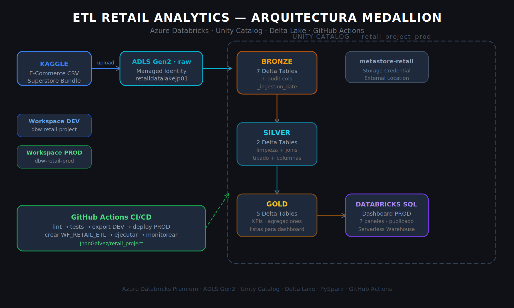
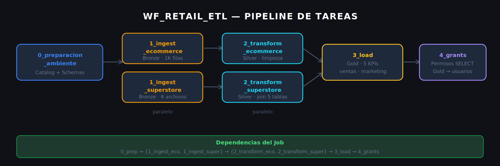
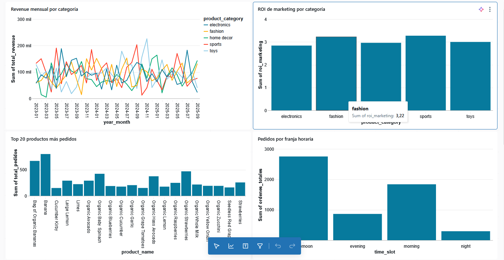
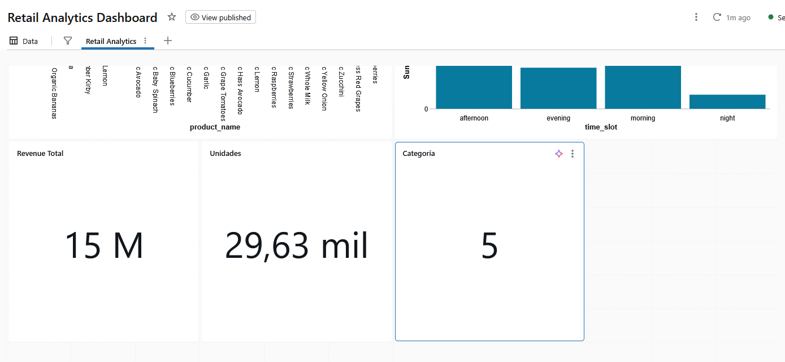

# ETL RETAIL ANALYTICS — Arquitectura Medallion en Azure Databricks

Pipeline ETL automatizado para análisis de ventas retail, implementando la Arquitectura Medallion (Bronze → Silver → Gold) con Azure Databricks, Unity Catalog, Delta Lake y CI/CD completo via GitHub Actions.

## 🎯 Descripción

Desarrollé un pipeline ETL que transforma datos crudos de ventas retail e historial de compras de supermercado en KPIs de negocio accionables. Implementé la Arquitectura Medallion en Azure Databricks con separación de ambientes DEV y PROD, integración continua con GitHub Actions y visualización en Databricks SQL Dashboard.

## ✨ Características Principales

* 🔄 **ETL Automatizado** — Pipeline completo con despliegue automático via GitHub Actions
* 🏗️ **Arquitectura Medallion** — Separación clara de capas Bronze → Silver → Gold
* 🔒 **Managed Identity** — Conexión al ADLS Gen2 sin keys ni secrets expuestos
* 🚀 **CI/CD Integrado** — Deploy automático en cada push a main
* 📊 **Databricks SQL Dashboard** — 7 paneles publicados en workspace PROD
* ⚡ **Delta Lake** — ACID transactions y schema enforcement
* 🧪 **Unit Tests** — 8 tests con pytest integrados al pipeline CI/CD
* 🔔 **Monitoreo** — Logs detallados del Job por tarea en tiempo real

## 🏛️ Arquitectura



## 🔄 Capas del Pipeline



## 📦 Datasets Utilizados

| Dataset | Fuente | Filas |
|---------|--------|-------|
| E-Commerce Sales Prediction | Kaggle — nevildhinoja | 1,000 |
| Supermarket / Superstore Bundle | Kaggle — amunsentom | 1M+ (muestra 500K) |

## 📁 Estructura del Repositorio

```
retail_project/
├── prepAmb/
│   └── 0_preparacion_ambiente.py       # Crea catalog y schemas en Unity Catalog
├── proceso/
│   ├── 0_preparacion_ambiente.py       # (copia para export CI/CD)
│   ├── 1_ingest_ecommerce.py           # Bronze: ingesta E-Commerce
│   ├── 1_ingest_superstore.py          # Bronze: ingesta Superstore (6 archivos)
│   ├── 2_transform_ecommerce.py        # Silver: limpieza E-Commerce
│   ├── 2_transform_superstore.py       # Silver: join 5 tablas Superstore
│   ├── 3_load.py                       # Gold: 5 tablas KPI
│   └── 4_grants.py                     # Seguridad: permisos sobre tablas Gold
├── reversion/
│   └── drop_medallion.py               # Reset completo del ambiente
├── seguridad/
│   └── grants.py                       # Permisos sobre tablas Gold
├── datasets/
│   ├── ecommerce_sample.csv            # Muestra E-Commerce (100 filas)
│   └── superstore_orders_sample.csv    # Muestra Superstore (100 filas)
├── dashboard/
│   └── dashboard.lvdash.json           # Dashboard exportado de PROD
├── src/
│   ├── config/config.py                # Configuracion central
│   └── utils/spark_utils.py            # Funciones reutilizables PySpark
├── tests/
│   └── test_transformations.py         # 8 unit tests con pytest
├── Arquitectura.png                    # Diagrama de arquitectura
├── pipeline.png                        # Diagrama del pipeline de tareas
└── .github/workflows/
    └── deploy.yml                      # CI/CD completo
```

## 📊 Tablas Gold — Dashboard

| Tabla | Descripción |
|-------|-------------|
| `gold.ventas_por_categoria` | Revenue mensual por categoría de producto |
| `gold.top_productos` | Top 20 productos más pedidos del Superstore |
| `gold.comportamiento_cliente` | Segmentos de cliente vs categorías |
| `gold.eficiencia_marketing` | ROI de marketing por categoría |
| `gold.actividad_por_horario` | Pedidos del Superstore por hora y día |

## 📈 Dashboard

Publiqué el **Retail Analytics Dashboard** en el workspace PROD con 7 paneles:
- Revenue mensual por categoría (line chart)
- ROI de marketing por categoría (bar chart)
- Top 20 productos más pedidos (bar chart)
- Pedidos por franja horaria (bar chart)
- KPI Cards: Revenue Total 15M · Unidades 29K · Categorías 5

🔗 **Dashboard**: [Ver en Databricks PROD](https://adb-7405604736822350.10.azuredatabricks.net/sql/dashboardsv3/01f13d01fcb21d079e2a0303a60bdebe)




## 🚀 Instalación y Configuración

### 1️⃣ Clonar el Repositorio

```bash
git clone https://github.com/JhonGalvez/retail_project
cd retail_project
```

### 2️⃣ Configurar Databricks Tokens

En cada workspace (DEV y PROD):
1. **User Settings** → **Developer** → **Access Tokens**
2. Click en **Generate New Token**
3. Configurar:
   - **Comment**: `GitHub CI/CD`
   - **Lifetime**: `90 days`
   - **Scope**: `Other APIs` → `all APIs`
4. ⚠️ Copiar y guardar el token

### 3️⃣ Configurar GitHub Secrets

En el repositorio: **Settings** → **Secrets and variables** → **Actions**

| Secret | Descripción |
|--------|-------------|
| `DATABRICKS_ORIGIN_HOST` | URL workspace DEV |
| `DATABRICKS_ORIGIN_TOKEN` | Token workspace DEV |
| `DATABRICKS_DEST_HOST` | URL workspace PROD |
| `DATABRICKS_DEST_TOKEN` | Token workspace PROD |

## 💻 Uso

### 🔄 Despliegue Automático (Recomendado)

```bash
git add .
git commit -m "feat: mejoras en pipeline ETL"
git push origin main
```

**GitHub Actions ejecutará automáticamente:**
- ✅ Lint del código con flake8
- ✅ Unit tests con pytest (8 tests)
- 📤 Export notebooks desde workspace DEV
- 🚀 Deploy notebooks al workspace PROD
- 🔧 Creación del workflow `WF_RETAIL_ETL` con 7 tareas
- ▶️ Ejecución completa: Bronze → Silver → Gold → Grants
- 📊 Monitoreo en tiempo real hasta completion

### 🖱️ Despliegue Manual desde GitHub

1. Ir al tab **Actions** en GitHub
2. Seleccionar **Deploy ETL Retail Analytics**
3. Click en **Run workflow** → **Run workflow**

### 🔧 Ejecución Local en Databricks DEV

Ejecutar en orden desde el workspace DEV:

```
prepAmb/0_preparacion_ambiente.py     → Crear catalog retail_project
proceso/1_ingest_ecommerce.py         → Bronze Layer · E-Commerce
proceso/1_ingest_superstore.py        → Bronze Layer · Superstore
proceso/2_transform_ecommerce.py      → Silver Layer · limpieza
proceso/2_transform_superstore.py     → Silver Layer · join 5 tablas
proceso/3_load.py                     → Gold Layer · 5 KPIs
proceso/4_grants.py                   → Permisos sobre Gold
```

## 🔄 CI/CD Pipeline

```
push a main
  ├── Lint (flake8)
  ├── Tests (pytest — 8 tests)
  ├── Export notebooks desde DEV workspace
  ├── Deploy notebooks a PROD (/retail_project/proceso)
  ├── Eliminar workflow anterior (si existe)
  ├── Buscar cluster por nombre (cluster-retail-prod)
  ├── Crear Job WF_RETAIL_ETL (7 tareas con dependencias)
  ├── Validar configuración del Job
  ├── Ejecutar Job automáticamente
  └── Monitorear hasta completion
```

## 🌐 Ambientes

| Ambiente | Workspace | Catalog |
|----------|-----------|---------|
| DEV | `dbw-retail-project` | `retail_project` |
| PROD | `dbw-retail-prod` | `retail_project_prod` |

## 🛠️ Tecnologías

- **Azure Databricks Premium** (DEV + PROD)
- **Azure Data Lake Storage Gen2** + Managed Identity
- **Unity Catalog** (metastore-retail) + Storage Credential + External Location
- **Delta Lake** (ACID transactions)
- **PySpark**
- **GitHub Actions**

## 🔍 Evidencias de Ejecución

### GitHub Actions CI/CD


### Workflow WF_RETAIL_ETL en Databricks PROD


## 👤 Autor

### Jhon Galvez

[](https://github.com/JhonGalvez)

**Data Engineering** | **Azure Databricks** | **Delta Lake** | **CI/CD**

📜 Certificaciones Databricks Academy disponibles en [`/certificaciones`](./certificaciones)

---

**Proyecto**: Ingeniería de Datos con Databricks
**Tecnología**: Azure Databricks + Delta Lake + CI/CD
